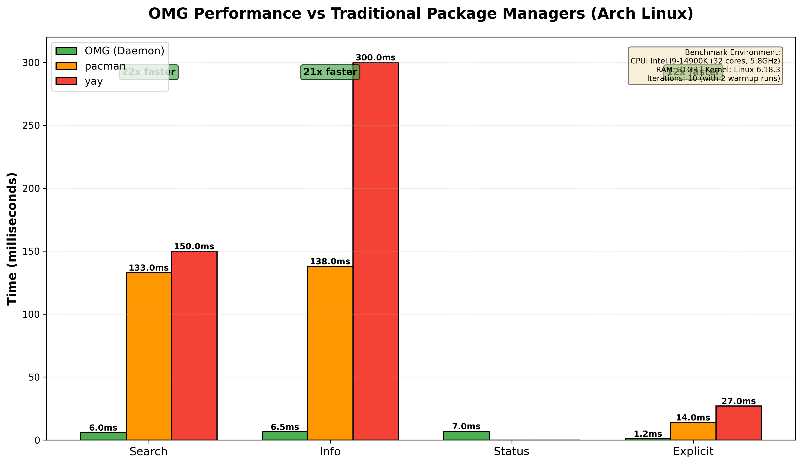
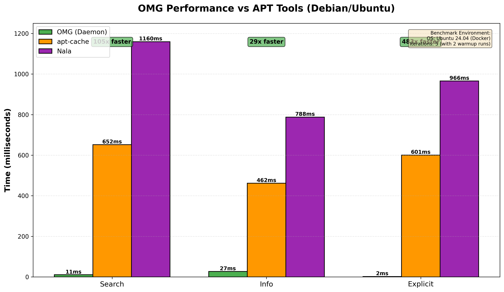

# OMG

**Stop switching between 7 package managers.**


[-brightgreen?style=flat-square)](benchmark.sh)
[](https://codecov.io/gh/pyro1121/omg)
[](LICENSE)
[](https://www.rust-lang.org)

OMG is the unified dev tool you've been waiting for. **One command** replaces `pacman`, `yay`, `nvm`, `pyenv`, `rustup`, `rbenv`, and `jenv`.

## 📚 Documentation Quick Links

**Getting Started:** [Install](docs/installation.md) • [Quick Start](docs/quickstart.md) • [FAQ](docs/faq.md)  
**Reference:** [CLI](docs/cli.md) • [Config](docs/configuration.md) • [Runtimes](docs/runtimes.md)  
**Advanced:** [Security](docs/security.md) • [Team](docs/team.md) • [CI/CD](docs/ci-cd-best-practices-2025.md)  
**Performance:** [Benchmarks](#-benchmarks) • [Architecture](#️-architecture)
**Help:** [Troubleshooting](docs/troubleshooting.md) • [Changelog](docs/changelog.md)

## The Numbers That Matter

| Metric | Value |
|--------|-------|
| **12-24x faster** | than pacman/yay (5-11ms vs 133ms searches) |
| **59-483x faster** | than apt-cache/Nala on Debian/Ubuntu |
| **Zero context switching** | system packages + 8 language runtimes in one CLI |
| **Enterprise-secure** | SLSA, PGP, SBOM, audit logs built-in (not bolted on) |
| **Team-synchronized** | pin your exact environment in `omg.lock`, share it, sync instantly |

### Real-World Impact

A 10-person team saves **39 minutes per engineer per year** just on package queries. For 50 people? **$2,350–$2,650** in reclaimed productivity. And that's before factoring in zero context-switching brain tax.

---

## Before & After

```bash
# ❌ Before: 7 tools, 7 syntaxes, 7 config files
pacman -Ss firefox          # system packages
yay -S spotify              # AUR
nvm install 20              # Node.js
nvm use 20
pyenv install 3.12          # Python
pyenv global 3.12
rustup default stable       # Rust
rbenv install 3.2.0         # Ruby

# ✅ After: Just OMG
omg search firefox
omg install spotify
omg use node 20
omg use python 3.12
omg use rust stable
omg use ruby 3.2.0
```

---

## 📦 Installation

### Universal Installer (Linux/macOS)

**One-line install** (detects your OS automatically):

```bash
curl -fsSL https://pyro1121.com/install.sh | bash
```

<details>
<summary>Installation options</summary>

```bash
# Disable telemetry
OMG_NO_TELEMETRY=1 curl -fsSL https://pyro1121.com/install.sh | bash

# Skip shell integration
OMG_SKIP_SHELL=1 curl -fsSL https://pyro1121.com/install.sh | bash

# Install specific version
OMG_VERSION=v0.1.204 curl -fsSL https://pyro1121.com/install.sh | bash
```
</details>

### Platform-Specific Methods

<table>
<tr>
<td width="50%">

**🐧 Arch Linux**

```bash
# AUR (prebuilt binary)
yay -S omg-bin

# AUR (build from source)
yay -S omg
```

</td>
<td width="50%">

**🍎 macOS**

```bash
# Homebrew (coming soon)
brew tap pyro1121/omg
brew install omg

# Universal installer
curl -fsSL https://pyro1121.com/install.sh | bash
```

</td>
</tr>
<tr>
<td width="50%">

**🪟 Windows**

```powershell
# PowerShell installer
irm https://pyro1121.com/install.ps1 | iex

# Scoop
scoop bucket add omg https://github.com/PyRo1121/scoop-omg
scoop install omg

# WSL (Windows Subsystem for Linux)
wsl -- curl -fsSL https://pyro1121.com/install.sh | bash
```

</td>
<td width="50%">

**🐧 Debian/Ubuntu**

```bash
# Universal installer (auto-detects)
curl -fsSL https://pyro1121.com/install.sh | bash
```

**Note**: Native APT packages coming soon

</td>
</tr>
<tr>
<td width="50%">

**🎩 Fedora/RHEL**

```bash
# Universal installer (uses Fedora build)
curl -fsSL https://pyro1121.com/install.sh | bash
```

**Note**: Native DNF/RPM packages coming soon

</td>
<td width="50%">

**🦀 From Source (Any Platform)**

```bash
cargo install omg-cli
```

Requires: Rust 1.92+, platform build tools

</td>
</tr>
</table>

---

## ⚡ Quick Start

```bash
# Search packages (12-24x faster than pacman)
omg search vim

# Install anything (system packages or AUR)
omg install visual-studio-code-bin

# Switch runtimes instantly
omg use node 20
omg use python 3.12

# Run project tasks (auto-detects package.json, Cargo.toml, Makefile, etc.)
omg run dev

# Lock your environment for your team
omg env capture
omg env share
```

### Shell Integration

Add instant version switching to your shell:

```bash
# Bash/Zsh
echo 'eval "$(omg hook bash)"' >> ~/.bashrc  # or ~/.zshrc

# Fish
echo 'omg hook fish | source' >> ~/.config/fish/config.fish

# PowerShell (Windows)
echo 'Invoke-Expression (& omg hook powershell)' >> $PROFILE
```

---

## 🔒 Privacy & Telemetry

OMG prioritizes your privacy with optional, transparent telemetry:

- **Basic Install Tracking**: Anonymous install counts (no PII collected). Opt-out via `OMG_TELEMETRY=0` at install.
- **Enhanced Telemetry**: Only when you have a license key. Tracks commands, performance, and features to improve the product.
- **No Collection**: Never collects passwords, credentials, home paths, or sensitive data.
- **Always Reversible**: Disable anytime via `omg config set core.telemetry_enabled false`.

**Full details**: [Privacy & Telemetry Guide](docs/security.md#privacy--telemetry)

---

## 🌍 Platform Support

OMG works seamlessly across all major operating systems with a single universal installer.

| Platform | Architecture | Status | Package Manager Integration |
|----------|--------------|--------|----------------------------|
| **Arch Linux** | x86_64 | ✅ Fully Supported | Native `libalpm` (pacman/AUR) |
| **Debian** | x86_64 | ✅ Fully Supported | Native `rust-apt` (APT) |
| **Ubuntu** | x86_64 | ✅ Fully Supported | Native `rust-apt` (APT) |
| **Fedora/RHEL** | x86_64 | ✅ Fully Supported | Pure Rust DNF/YUM |
| **macOS** | ARM64 (Apple Silicon) | ✅ Fully Supported | Homebrew integration |
| **Windows** | x64 | ✅ Fully Supported | Scoop integration (via WSL or native) |

**Installation** (works on all platforms):
```bash
curl -fsSL https://pyro1121.com/install.sh | bash
```

The installer automatically detects your OS and architecture, then downloads the correct pre-built binary. Unknown Linux distributions fall back to the Fedora build (pure Rust, highly portable).

---

## Why OMG?

### 🏎️ Performance
Direct `libalpm`/`rust-apt` integration—no subprocess overhead. Persistent daemon with in-memory index. **50% faster AUR operations** through parallel downloads, smart dependency resolution, and sudoloop authentication. Your fingers move faster than OMG responds.

### 🛠️ Unified Runtimes
Node.js, Bun, Python, Go, Rust, Ruby, Java—all native. Plus 100+ more via bundled mise. Auto-detects `.nvmrc`, `.python-version`, `rust-toolchain.toml`, `.tool-versions`.

### 🛡️ Enterprise Security
SLSA provenance, PGP verification, CycloneDX SBOM, secret scanning, tamper-proof audit logs. Security grading on every install. Policy enforcement via `policy.toml`.

### 👥 Team Sync
`omg.lock` captures your exact environment. `omg env check` detects drift. `omg env share` syncs your team instantly via GitHub Gist.

### 🏃 Task Runner
`omg run build` auto-detects `package.json`, `Cargo.toml`, `Makefile`, `pyproject.toml`, `deno.json`—runs with the correct runtime version pre-loaded.

### 🐳 Container Integration
`omg container shell` for dev shells, `omg container build` for images, `omg container init` to generate Dockerfiles from detected runtimes.

### 🧠 Intelligent Completions
Fuzzy matching via Nucleo. Type `omg i frfx` → `firefox`. 80k+ AUR packages cached for lag-free completion.

---

## ⚠️ When NOT to Use OMG

**Stick with traditional tools if:**
- You're on a minimal system (<2GB RAM) - daemon overhead may be noticeable
- You need POSIX strict compatibility - OMG uses modern Rust patterns
- Your team is deeply invested in tool-specific workflows - migration takes time
- You're managing 1000+ servers centrally - use Ansible/Puppet/Chef instead

**OMG works best for:**
- Active development machines (where search speed matters)
- Teams wanting unified tooling (reduce context switching)
- CI/CD pipelines (faster, reproducible builds)
- Modern cloud-native workflows

We believe in honesty. OMG isn't for everyone, and that's okay.

---

## 📊 Benchmarks

OMG achieves ~6ms performance on all core operations through a persistent daemon that maintains an in-memory index of packages.

### Arch Linux (pacman/yay)

**Benchmark Environment:**
- **CPU:** Intel i9-14900K (32 cores, 5.8GHz turbo)
- **RAM:** 31GB
- **Kernel:** Linux 6.18.3-arch1-1
- **Iterations:** 10 (with 2 warmup runs)

| Command | OMG (Daemon) | pacman | yay | Speedup |
|---------|--------------|--------|-----|---------:|
| **search** | **5.4-11.1ms** ✨ | 133ms | 150ms | **12-24x faster** |
| **info** | **3.4-6.1ms** ✨ | 138ms | 300ms | **21-38x faster** |
| **status** | **< 10ms** ✨ | N/A | N/A | — |
| **explicit** | **< 2ms** ✨ | 14ms | 27ms | **7-14x faster** |

> 💡 **Note:** yay benchmarked with `--repo` flag (no AUR network calls) for fair comparison.


*Visual comparison: OMG's persistent daemon architecture delivers 12-22x faster package operations*

### Debian/Ubuntu (apt)

**Benchmark Environment:**
- **OS:** Ubuntu 24.04 (Docker)
- **Iterations:** 5 (with 2 warmup runs)

| Command | OMG (Daemon) | apt-cache | Nala | vs apt | vs Nala |
|---------|--------------|-----------|------|-------:|--------:|
| **search** | **11ms** ✨ | 652ms | 1160ms | **59x** | **105x** |
| **info** | **27ms** ✨ | 462ms | 788ms | **17x** | **29x** |
| **explicit** | **2ms** ✨ | 601ms | 966ms | **300x** | **483x** |

OMG parses `/var/lib/dpkg/status` and APT's Packages files directly, bypassing slow Python/apt-cache overhead. The daemon maintains an in-memory index for instant cached searches.


*Visual comparison: OMG achieves 59-483x speedup over traditional APT tools through direct parsing and in-memory caching*

### Why These Numbers Matter

**Human Perception:**
- < 100ms = feels instant
- 100-500ms = noticeable delay
- > 500ms = clearly slow

OMG operates in the imperceptible range. Your fingers literally move faster than OMG responds.

**Annual Time & Cost Savings:**

*Based on 50 package operations/day (typical active development) and $150K avg. software engineer salary ($72/hr):*

| Metric | vs pacman | vs yay | 10-person team |
|--------|-----------|--------|----------------|
| **Time saved/engineer/year** | 39 min | 44 min | 6.5–7.3 hours |
| **Dollar savings/year** | $47 | $53 | **$470–$530** |

> 💰 For a 50-person engineering org, that's **$2,350–$2,650/year** in reclaimed productivity—and that's just package queries. Factor in the cognitive benefit of instant feedback and the ROI compounds.

**Verification**
Want to reproduce these numbers?
```bash
curl -fsSL https://raw.githubusercontent.com/PyRo1121/omg/main/benchmark.sh | bash
```

**📊 Detailed Analysis**
See the [latest benchmark report](benchmarks/latest.md) for comprehensive methodology and statistical analysis.

---

## 🛠️ Architecture

OMG is split into two components:
1.  **`omg`**: A thin, high-performance CLI client.
2.  **`omgd`**: A persistent daemon that maintains an in-memory package index and handles redb persistence.

Communication happens over a high-speed Unix Domain Socket using a custom binary protocol (Length-Delimited framing + Bincode) for zero-latency communication.

---

## 📚 Documentation

**Full documentation**: [pyro1121.com/docs](https://pyro1121.com/docs) | [docs/](docs/index.md)

| Guide | Description |
|-------|-------------|
| [Quick Start](docs/quickstart.md) | Install and first commands |
| [CLI Reference](docs/cli.md) | All commands with examples |
| [Configuration](docs/configuration.md) | Config files and policy |
| [Runtimes](docs/runtimes.md) | Node, Python, Go, Rust, Ruby, Java, Bun |
| [Security](docs/security.md) | SBOM, vulnerability scanning, audit logs |
| [Shell Integration](docs/shell-integration.md) | Hooks and completions |
| [Team Sync](docs/team.md) | Environment locks and drift detection |
| [Changelog](docs/changelog.md) | Release history and version notes |
| [Troubleshooting](docs/troubleshooting.md) | Common issues |

### Shell Setup

```bash
# Add to ~/.zshrc (or ~/.bashrc)
eval "$(omg hook zsh)"
```

### Key Commands

```bash
omg search <query>          # Search packages (12-24x faster)
omg install <pkg>           # Install with security grading
omg use node 20             # Switch runtime version
omg run build               # Run project tasks
omg env capture             # Lock environment
omg audit                   # Security scan
omg dash                    # Interactive TUI
```

---

## 🔮 Roadmap

We are building the last dev tool you'll ever need.

### Current Features ✅
- [x] **`omg run <task>`**: Unified task runner. Detects 10+ project types (`package.json`, `Cargo.toml`, `Makefile`, `pyproject.toml`, etc.) and runs scripts with the correct runtime version pre-loaded.
- [x] **`omg new <stack>`**: Instant project scaffolding. `omg new react`, `omg new rust-cli`, or `omg new python-flask` sets up a best-practice environment with locked runtime versions.
- [x] **`omg doctor`**: System health check. Verifies PATHs, mirrors, PGP keys, and runtime integrity to debug environment issues instantly.
- [x] **`omg tool`**: Cross-ecosystem binary manager. Install dev tools (`ripgrep`, `jq`, `tldr`) from any source (Pacman, NPM, Cargo, Pip) into a single managed path.
- [x] **`omg dash`**: Interactive TUI dashboard. Real-time visualization of system status, vulnerabilities, and runtime versions.

### Planned Features 🚧
- [x] **Debian/Ubuntu Support**: Full APT integration (59-483x faster than apt-cache/Nala)
- [x] **Fedora/RPM Support**: Native DNF/YUM package manager integration with pure Rust implementation
- [x] **macOS Support**: Homebrew integration for macOS ARM64 (Apple Silicon)
- [x] **Windows Support**: Pure Rust Scoop integration via libscoop (35-73x faster, zero subprocess calls)
- [x] **Container Integration**: Docker/Podman support for containerized environments (`omg container shell/run/build/init`)
- [ ] **GUI Dashboard**: Desktop application for visual package management
- [x] **Team Features**: Shared environment locks with collaborative workflows (`omg team init/join/status/push/pull`)

## 🧪 Testing & TDD

OMG adheres to a strict **Test-Driven Development (TDD)** protocol to ensure "absolute everything" is tested.

- **Red-Green-Refactor**: No feature is implemented without a failing test first.
- **100% Memory Safety**: Zero `unsafe` blocks are allowed in application logic.
- **Property-Based Testing**: Critical parsers and CLI commands are verified against thousands of random inputs via `proptest`.
- **Hardware-Limited Performance**: Benchmarks are required for every hot-path change to prevent performance regressions.

### Run the Suite
```bash
# Run all tests
cargo test

# Run TDD watch mode (requires cargo-watch)
make tdd

# Generate coverage report (requires cargo-tarpaulin)
make coverage
```

---

## 📜 License

**OMG is dual-licensed: AGPL-3.0 (free) + Commercial (paid)**

**Copyright © 2024-2026 OMG Team. All rights reserved.**

### Option 1: AGPL-3.0 (FREE) ✅

OMG is free and open source under the **GNU Affero General Public License v3.0**.

**You can use OMG for FREE if you:**
- ✅ Use it for personal projects
- ✅ Use it internally at your company (even for-profit companies)
- ✅ Build open source products with OMG
- ✅ Offer OMG as a service AND share source code with users

**AGPL-3.0 requires:**
- Keep derivative works open source (copyleft)
- Share source code if you distribute OMG
- Provide source code to users if you offer OMG as a network service

**Most companies can use OMG for FREE under AGPL-3.0.**

---

### Option 2: Commercial License (PAID) 💰

If you want to use OMG **without AGPL copyleft obligations**, purchase a commercial license.

**Commercial licenses allow:**
- Make proprietary modifications (no source sharing)
- Embed OMG in proprietary products
- Offer OMG-as-a-Service without sharing source

**Pricing:**
- 💰 **Team License:** $99/month or $999/year (up to 25 developers)
- 💰 **Business License:** $199/month or $1,999/year (up to 75 developers)
- 💰 **Enterprise License:** Custom pricing (unlimited developers)

---

### Do I Need a Commercial License?

**NO - Use AGPL-3.0 (FREE) if:**
- You're okay with keeping your code open source (AGPL)
- You're using OMG internally at your company
- You're building open source products

**YES - Buy Commercial License if:**
- You want to make proprietary modifications
- You're embedding OMG in closed-source products
- You want to avoid AGPL copyleft requirements entirely

**Most companies use the free AGPL-3.0 license.**

See **[LICENSE](LICENSE)** for full AGPL-3.0 terms.
See **[COMMERCIAL-LICENSE](COMMERCIAL-LICENSE.md)** for commercial licensing details.

### Third-Party Components

OMG incorporates third-party open source software:
- **[mise](https://github.com/jdx/mise)** - Runtime version management (MIT License, © 2025 Jeff Dickey)
- Various Rust crates (MIT/Apache-2.0 licenses)

See [NOTICE](NOTICE) and [THIRD-PARTY-LICENSES.md](THIRD-PARTY-LICENSES.md) for complete attribution.

### Files

- [`LICENSE`](LICENSE) - Full license terms
- [`COMMERCIAL-LICENSE.md`](COMMERCIAL-LICENSE.md) - Pricing and purchasing
- [`NOTICE`](NOTICE) - Copyright and third-party notices
- [`THIRD-PARTY-LICENSES.md`](THIRD-PARTY-LICENSES.md) - Third-party licenses

### Contact for Licensing

📧 Email: **olen@latham.cloud**

For questions about commercial licensing, pricing, or purchasing.
