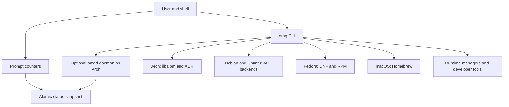

# OMG

<div align="center">

[](https://github.com/PyRo1121/omg/actions)
[](LICENSE)
[](https://getomg.xyz)
[](https://getomg.xyz/docs)
[](rust-toolchain.toml)

**Packages and runtimes. One workflow. Built-in security checks.**

*Packages. Runtime versions. Project tasks. Declarative environment records.*  
*A Rust CLI for managing your development stack, with verification and controlled privilege elevation built into installation.*

[Website](https://getomg.xyz) · [Documentation](https://getomg.xyz/docs) · [Quickstart](docs/quickstart.md) · [Installation](docs/installation.md) · [CLI Reference](docs/cli.md) · [Architecture](docs/architecture.md) · [Security Model](docs/security.md) · [Report Issue](https://github.com/PyRo1121/omg/issues)

</div>

---

> [!IMPORTANT]
> **Alpha Development Notice**: OMG is under active alpha development. Command surfaces, configuration flags, and on-disk formats may evolve. Always test package mutations on disposable VMs or recoverable developer machines. Keep native package tools (`pacman`, `apt`, `dnf`, `brew`) available.

---

## Why OMG?

OMG brings system packages, language runtimes, and project tasks into one CLI. Use the same commands across supported platforms while keeping access to their native package tools.

| What you need | OMG workflow |
| :--- | :--- |
| **System packages** | `omg search` · `omg install` · `omg update` · `omg why` |
| **Language runtimes** | `omg use <runtime> [version]` · `omg which <runtime>` |
| **Project tasks** | `omg run <dev\|test\|build\|lint>` resolves the project runner |
| **Environment records** | `omg env capture` creates `omg.lock`; `omg env check` reports drift on supported backends |
| **AUR build controls** | Source review, offline Bubblewrap builds by default, archive inspection, and sealed artifact handoff |
| **Shell status** | Prompt counters read atomic status snapshots without starting the daemon or querying the package manager |

## Security Built Into Installation

Version 0.1.221 includes the merged hardening across downloads, builds, filesystem writes, and privileged package transactions. The [release overview and complete commit ledger](docs/releases/v0.1.221.md) link the security work and compatibility changes since 0.1.220. Check the [published releases](https://github.com/PyRo1121/omg/releases) against your installed version.

| Boundary | Protection |
| :--- | :--- |
| **Downloads and signing trust** | Runtime installers verify supported checksums or signatures and reject missing required integrity evidence. Swift signature verification restricts downloaded keyrings to explicitly allowed signing fingerprints. |
| **AUR source and build** | Review is enabled by default, source manifests are rechecked before execution, and Bubblewrap builds use an isolated home, a cleared environment, and no build network by default. |
| **AUR output** | Bounded archive inspection checks paths, metadata, links, and privileged contents before installation. Install hooks, capabilities, and setuid/setgid files require explicit attended approval. |
| **High-risk AUR packages** | Selected packages with privileged or system-integration contents require matching outputs from a second private build. Approval is bound to the inspected archive hashes. |
| **Privilege and filesystem handoffs** | Privileged subprocesses use trusted executable paths and scrub dangerous environment settings. Sealed AUR archives, ownership checks, anchored file operations, and exact-destination installer replacement protect installation boundaries. |
| **Verification and evidence** | Regression tests exercise security boundaries. CI, release smoke tests, and QEMU guest runs check supported platform behavior and retain bounded failure evidence. Release smoke verifies downloaded archive provenance before execution. |

Run OMG as your regular user; it requests elevation for package mutations. Direct root startup is deprecated, and AUR builds refuse root execution. Runtime smoke checks clear inherited environment settings; that cleanup alone is not a filesystem or network sandbox.

These controls reduce specific risks; they do not establish that community code is benign or that every backend supports the same operations. Matching builds are evidence of reproducibility, not a safety verdict. Read the [AUR security workflow and opt-ins](docs/aur.md), [security model](docs/security.md), and [verification workflows](https://github.com/PyRo1121/omg/actions).

---

## Quickstart

Start with repository queries and a package preview:

```bash
omg search ripgrep
omg info ripgrep
omg install --dry-run ripgrep
```

Then use OMG in a project you trust. Runtime selection may download and install a toolchain in your user directory, and project tasks execute project code. Environment capture writes an `omg.lock` record:

```bash
# 1. Switch or auto-detect a project runtime (e.g. Node 22, Python 3.12, Rust stable)
omg use node 22
omg which node

# 2. Execute any project script (detects package.json, Cargo.toml, Makefile, etc.)
omg run build

# 3. Snapshot and verify environment state against drift
omg env capture
omg env check

```

---

## Installation

Existing Bash, Zsh and Fish hooks can show a quiet update notice when a terminal
opens. Checks run in the background at most daily; installation remains explicit.
See [terminal update notices and opt-out](docs/update-notices.md).

Release artifacts are cryptographically signed and attested through GitHub Actions. Verification requires `curl` and GitHub CLI (`gh`).

### Option A: Standard Inspected Install (Recommended)

Review the installer before execution, with telemetry disabled and shell edits bypassed:

```bash
# 1. Download installer for review
curl --proto '=https' --tlsv1.2 -fsSL https://getomg.xyz/install.sh -o omg-install.sh

# 2. Inspect script contents
less omg-install.sh

# 3. Install without telemetry or automatic shell edits
OMG_NO_TELEMETRY=1 OMG_SKIP_SHELL=1 bash omg-install.sh

# 4. Export to PATH and verify
export PATH="$HOME/.local/bin:$PATH"
omg --version
omg doctor
```

### Option B: Quick Install (Linux & macOS)

```bash
curl --proto '=https' --tlsv1.2 -fsSL https://getomg.xyz/install.sh | bash
```

### Option C: Arch Linux (AUR)

```bash
yay -S omg-bin      # Precompiled release with daemon
# or build from source:
yay -S omg
```

### Option D: Build from Source

Requires Rust 1.95.0 (`rust-toolchain.toml`). Select your platform's backend feature:

```bash
# Arch Linux
cargo build --release --locked --no-default-features --features arch,pgp,license

# Debian / Ubuntu
cargo build --release --locked --no-default-features --features debian,pgp,license

# Fedora
cargo build --release --locked --no-default-features --features fedora,pgp,license

# macOS (Apple Silicon)
cargo build --release --locked --no-default-features --features macos,pgp,license
```

> Windows users can run OMG inside [WSL2](https://learn.microsoft.com/en-us/windows/wsl/install) on a supported Linux distribution (Arch, Debian, or Ubuntu). A PowerShell helper is available at `https://getomg.xyz/install.ps1`. See [Installation Reference](docs/installation.md).

---

## System Architecture

The CLI works directly with the selected package backend and runtime managers. On Arch, the optional `omgd` daemon keeps package indexes warm; prompt counters read a status snapshot directly.



- **Native Arch queries:** OMG reads local and sync package databases through `libalpm`.
- **Cached search:** The daemon uses `moka` for caching and `nucleo` for fuzzy matching.
- **Direct operation:** Package commands do not require the daemon to be running.
- **Backend-specific behavior:** Supported mutations, audit operations, and environment records vary by backend; see the matrix below.

---

## Core Capabilities & Everyday Workflows

### 1. Unified Native Package Operations
One clear syntax across package backends. Search repositories, inspect dependencies, review reverse dependencies, and preview changes without switching tools:

```bash
# Search official repositories (and AUR on Arch)
omg search ripgrep
# Or use the quick alias:
omg s ripgrep

# Inspect why a package is installed and its dependency tree
omg info ripgrep
omg why ripgrep

# Preview installation without modifying system packages
omg install --dry-run ripgrep

# Install package (prompts for PKGBUILD review on AUR builds)
omg install ripgrep

# System-wide upgrade
omg update
```

### 2. Polyglot Runtime Management
Install and switch runtime versions per project or globally. Download and build prerequisites vary by runtime.

OMG manages **14 native runtimes**: `node`, `python`, `go`, `rust`, `ruby`, `java`, `bun`, `deno`, `pi`, `zig`, `dotnet`, `erlang`, `php`, and `swift` (plus 54 registry developer tools).

```bash
# Switch runtime for the current project session
omg use node 22
omg use python 3.12
omg use rust stable
omg use go 1.22
omg use deno latest

# Automatically switch when changing directories (reads .nvmrc, go.mod, pyproject.toml, etc.)
echo "20.11.0" > .nvmrc
cd .
# ✓ Active Node.js switched to 20.11.0

# Inspect active binary resolution
omg which node
```

#### Shell Integration
Enable automatic directory switching by adding the hook to your shell configuration:
```bash
# Bash: ~/.bashrc
eval "$(omg hook bash)"

# Zsh: ~/.zshrc
eval "$(omg hook zsh)"

# Fish: ~/.config/fish/config.fish
omg hook fish | source
```

### 3. Unified Project Task Runner
Execute project lifecycles across ecosystems without remembering whether a repository uses `npm`, `pnpm`, `bun`, `cargo`, `make`, or `poetry`:

```bash
# Runs "build" via detected package.json / Cargo.toml / Makefile / pyproject.toml
omg run build

# Pass custom arguments directly to the underlying tool
omg run test -- --nocapture
```

### 4. Declarative Environment Locking (`omg.lock`)
Record package and runtime versions and detect drift across developer workstations and CI pipelines. Environment fingerprinting requires an Arch or Debian package backend; Fedora currently refuses these operations explicitly:

```bash
# Snapshot active system packages and project runtime versions
omg env capture

# Verify current machine against the recorded specification (exits nonzero on drift)
omg env check
```

### 5. Interactive Terminal Dashboard (TUI)
Full-screen terminal dashboard built with Ratatui for visual package management, health monitoring, and transaction logs:

```bash
omg dashboard
# Or quick alias:
omg dash
```

### 6. High-Speed In-Memory Daemon
An optional background daemon keeps repository indexes and caches warm for instantaneous search and status responses:

```bash
# Start and inspect the background daemon
omg daemon start
omg daemon-status
```

### 7. Supply Chain Security & Auditability
- **CycloneDX 1.5 SBOM**: Generate comprehensive package inventories via `omg audit sbom`.
- **AUR Source and Artifact Review**: Source review is enabled by default; archive inspection and privileged-content approval protect later handoffs.
- **SLSA / Rekor Verification**: Inspect build provenance and Rekor transparency logs with `omg audit slsa --certificate-identity <identity> <artifact>`.
- **Transaction History and Rollback**: Inspect recorded changes and use `omg rollback` where supported; recovery depends on backend support and package availability.

---

## Platform & Backend Support Matrix

| Platform | Architecture | Package Backend | Daemon (`omgd`) | Coverage / Status |
| :--- | :--- | :--- | :---: | :--- |
| **Arch Linux** | `x86_64` | Native `libalpm` + AUR | Supported | Official repository and AUR workflows; alpha, with source and artifact checks |
| **Debian** | `x86_64` | Native APT | Direct Fallback | Native APT package search, installation, and queries |
| **Ubuntu** | `x86_64` | Native APT | Direct Fallback | Native APT package search, installation, and queries |
| **Fedora** | `x86_64` | DNF | Direct Fallback | Experimental DNF backend (package mutations under active validation) |
| **macOS** | `aarch64` (Apple Silicon) | Homebrew | Direct Fallback | Native ARM64 binary with Homebrew package integration |
| **Windows** | `x86_64` | WSL2 | Supported | Supported via Linux guest in WSL2 (Arch, Ubuntu, or Debian) |

> [!NOTE]
> Daemon distribution is currently included in Arch Linux release archives. On other platforms, the `omg` CLI operates autonomously via direct execution fallbacks. Review [Installation Limits](docs/installation.md) for backend-specific details.

---

## Security Model & Integrity Disclosures

The security model includes explicit trust and coverage limits:

1. **Supply Chain Attestation**: Official release archives and Cargo-generated SBOMs are cryptographically attested via GitHub Actions. The installer verifies digests and signatures using the GitHub CLI (`gh attestation verify`).
2. **AUR Safety Boundaries**: AUR packages contain community-submitted code. OMG enables interactive source review and isolated Bubblewrap builds by default. Network access and native builds require explicit configuration opt-ins; see [AUR policy](docs/aur.md).
3. **Audit Limits**:
   - `omg audit sbom` produces a CycloneDX 1.5 JSON inventory with Arch Linux Security Advisory matching. It does not generate full transitive application dependency graphs for Debian or macOS.
   - `omg audit slsa` verifies supported Rekor signatures and Fulcio certificate chains for an artifact; it requires `--certificate-identity` and does not certify SLSA Levels 1–3 or build provenance.
   - Audit log verification (`omg audit verify`) confirms internal SHA-256 hash-chain consistency, not independent root-level authenticity.
   - OMG is not a compliance certification tool for SOC 2, ISO 27001, HIPAA, PCI DSS, or FedRAMP.
4. **Transparent Benchmarks**: We do not claim universal speedups. Performance varies by backend, cache state, repository size, and storage hardware. Inspect our methodology and raw records in [benchmarks/README.md](benchmarks/README.md).

---

## Documentation Hub

- 🚀 **[Quickstart Guide](docs/quickstart.md)** — Run your first runtime and task in 2 minutes.
- 📦 **[Installation Details](docs/installation.md)** — Requirements, checksums, distro configurations.
- 💻 **[Complete CLI Reference](docs/cli.md)** — Every command, flag, and option documented.
- ⚙️ **[Runtime Management](docs/runtimes.md)** — In-depth guide to runtime versioning and shell hooks.
- 🏃 **[Task Runner Guide](docs/task-runner.md)** — Resolution hierarchy, script definitions, and priorities.
- 🏛️ **[Architecture & Internals](docs/architecture.md)** — Deep dive into IPC, socket framing, and caching.
- 🔒 **[Security & Audit](docs/security.md)** — Vulnerability scanning, SBOM generation, and evidence limits.
- 🛠️ **[Cheatsheet](docs/cheatsheet.md)** — High-frequency commands for everyday development.
- 🩺 **[Troubleshooting](docs/troubleshooting.md)** — Resolving path errors, cache misses, and daemon issues.

---

## Contributing & Community

Contributions are welcome! Read [CONTRIBUTING.md](CONTRIBUTING.md) to understand development workflows, QEMU multi-distro test environments, and code standards.

- **Issue Tracker**: [GitHub Issues](https://github.com/PyRo1121/omg/issues) (include `omg --version`, distribution, and command output).
- **Vulnerability Disclosures**: Privately report security concerns via `<olen@latham.cloud>` per [SECURITY.md](SECURITY.md).

---

## License

OMG is open source under the [MIT License](LICENSE).  
Copyright © 2024–2026 Olen Latham.
