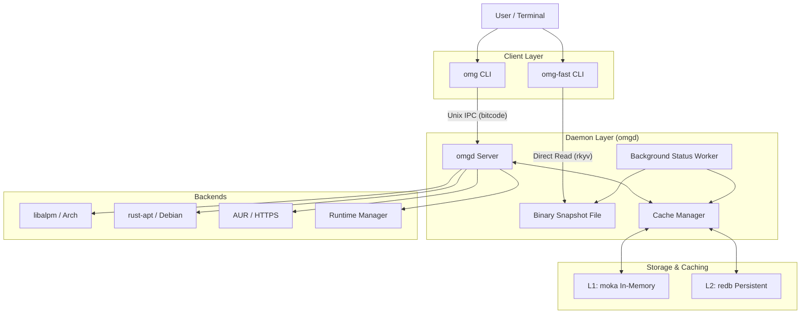
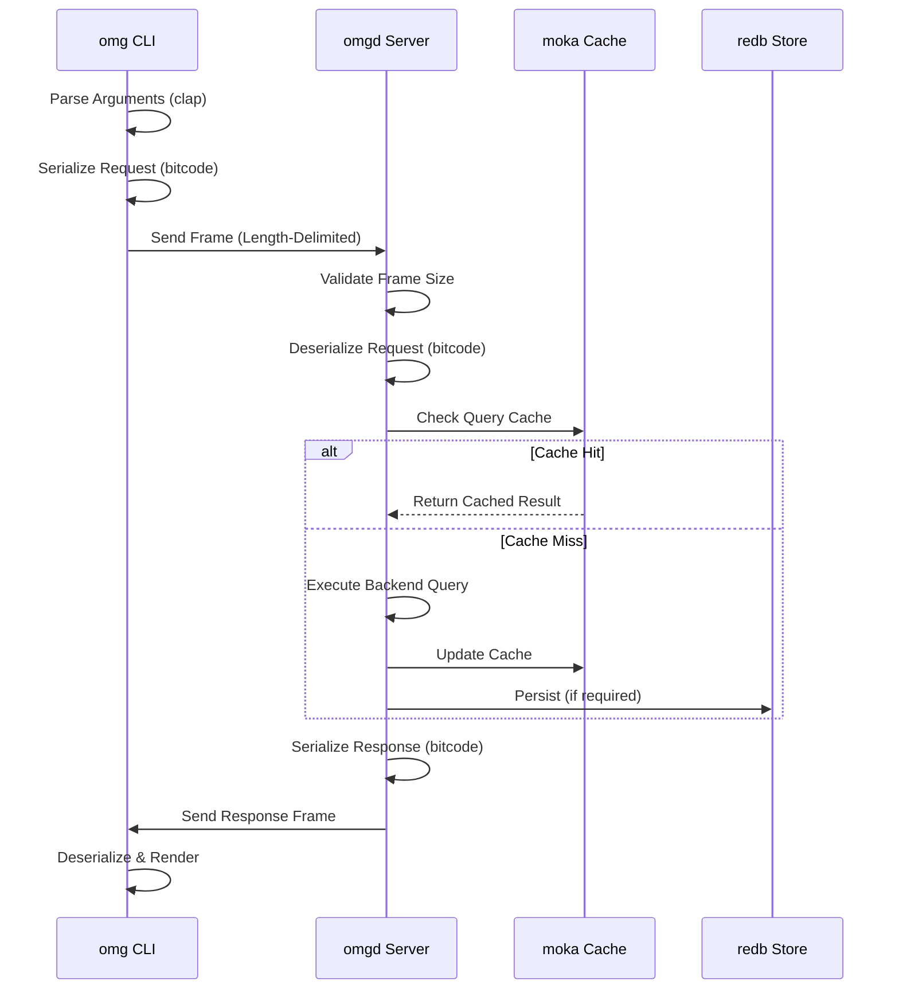
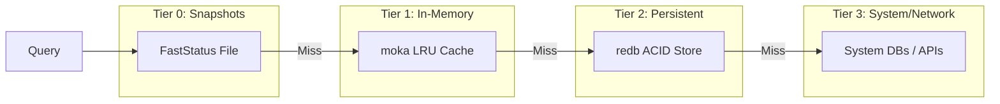
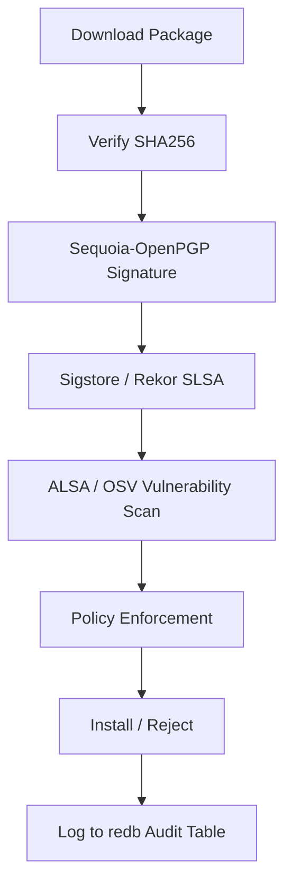

# Architecture Overview

**System Design and Component Architecture**

This document provides a deep dive into OMG's architecture, component interactions, and the high-performance design decisions that enable sub-10ms package operations.

---

## 🏗️ System Overview

OMG uses a distributed daemon-client model designed for zero-overhead interaction.

---

## 🔌 Unix IPC Flow (bitcode)

OMG uses a custom binary protocol over Unix Domain Sockets. This ensures minimal overhead and maximum throughput.

### Protocol Characteristics
- **Transport**: Unix Domain Sockets (UDS) for local-only, high-speed communication.
- **Framing**: `LengthDelimitedCodec` ensures atomic message delivery.
- **Serialization**: `bitcode` provides high-speed binary encoding with optional zero-copy support.
- **Concurrency**: `tokio` handles thousands of concurrent IPC requests with minimal context switching.

---

## 💾 Multi-Tier Caching Strategy

OMG employs a tiered approach to data availability, ensuring that common queries never hit the disk or network.

### 1. In-Memory (moka)
The **moka** cache handles high-frequency data:
- **Search Results**: Cached for 5 minutes.
- **Package Details**: Cached for 10 minutes.
- **Rate Limit Buckets**: Managed per-connection.

### 2. Persistent (redb)
The **redb** store handles data that must survive reboots:
- **Pre-computed Index**: Cold-start search results.
- **Audit Logs**: Tamper-proof history.
- **Security Scores**: Cached SLSA/PGP validation results.

### 3. Binary Snapshot (rkyv)
A specialized file (`~/.local/share/omg/status.bin`) stores a zero-copy AST of system health. This allows `omg-fast` to provide shell prompt updates in **<500μs**.

---

## 🛡️ Security Architecture

The daemon enforces a multi-stage validation pipeline for every package operation.

### Components
- **Sequoia-OpenPGP**: Native Rust implementation of OpenPGP for signature verification.
- **Sigstore/Rekor**: Integration with the Sigstore transparency log for SLSA provenance.
- **OSV.dev**: Real-time vulnerability matching against global databases.

---

## 🔧 Runtime Management

OMG manages language runtimes via a unified trait system.

- **Native Managers**: Custom Rust implementations for Node.js, Python, Rust, Go, Ruby, Java, and Bun.
- **mise Fallback**: Seamless integration with the `mise` ecosystem for 100+ additional runtimes.
- **Environment Isolation**: Runtimes are stored in `~/.local/share/omg/versions`, avoiding the need for `sudo`.

---

## 📚 Further Reading

- [IPC Protocol Deep Dive](./ipc.md)
- [Caching System Internals](./cache.md)
- [Security Model & Compliance](./security.md)
