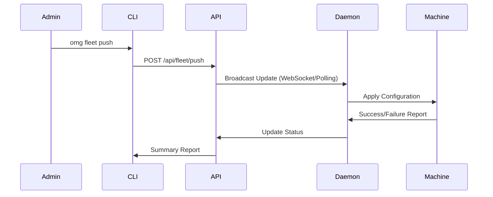

# Fleet Management

**Enterprise Fleet Control**

OMG provides built-in fleet management capabilities, allowing organizations to monitor compliance, enforce policies, and manage drift across hundreds or thousands of machines.

:::info Enterprise Feature
This feature requires an Enterprise license.
:::

---

## 📊 Fleet Status

Get a real-time overview of your entire fleet's health. The central dashboard aggregates data from all machines running the `omgd` daemon.

```bash
omg fleet status
```

**This command displays:**
- **Total Machines**: Count of active nodes.
- **Health Score**: Overall compliance percentage based on policy adherence.
- **Drift Analysis**: Machines that have deviated from the organization's "Golden Path" baseline.
- **Team Breakdown**: Compliance stats per team (Frontend, Backend, etc.).

### Verbose Output

For detailed machine-level data (IP address, OS, active version, last seen):

```bash
omg fleet status --verbose
```

---

## 🚀 Pushing Configurations

Push configuration updates, policy changes, or immediate remediations to specific teams or the entire fleet instantly.

```bash
# Push to all machines
omg fleet push -m "Global security update"

# Push to a specific team
omg fleet push --team frontend --message "Update Node.js version to 22"
```

### How Push Works



---

## 🔧 Automated Remediation

OMG can automatically fix configuration drift, ensuring that all machines in the fleet stay compliant with the defined standards.

```bash
# Preview changes (Dry Run)
omg fleet remediate --dry-run

# Apply fixes across the fleet
omg fleet remediate --confirm
```

**Remediation handles:**
- **Package Integrity**: Re-installing missing packages or correcting versions.
- **Runtime Versions**: Enforcing specific language versions (e.g., Node.js LTS).
- **Security Policies**: Re-applying organization-wide security rules.
- **Environment Consistency**: Synchronizing configuration files (`omg.toml`).

---

## 🏗️ Architecture

The fleet agent runs as part of the `omgd` background service, checking in with the central control plane periodically.

- **Minimal Overhead**: Uses less than 10MB of RAM and negligible CPU.
- **Bandwidth Aware**: Respects network limits and uses delta-updates for configurations.
- **Secure**: All communication is encrypted and authenticated via machine-specific tokens.
- **Offline Capable**: Enforces local policies even when disconnected from the control plane.
