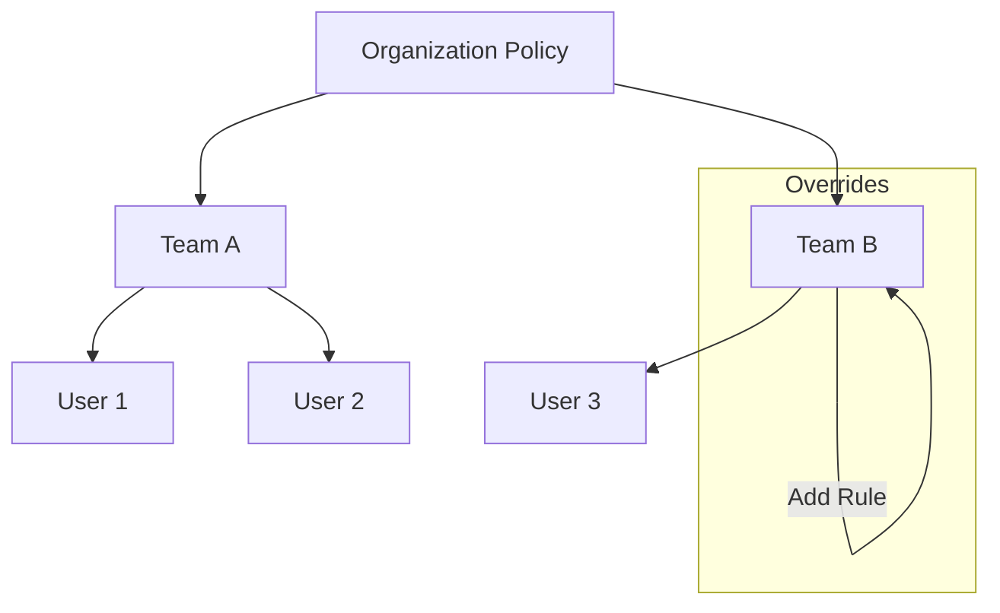

# Enterprise Features

**Compliance, Reporting, and Control**

OMG Enterprise provides the tools large organizations need to manage software supply chain security, compliance, and infrastructure at scale.

---

## 📋 Executive Reports

Generate JSON reports containing observed fleet and local process counters. OMG does not estimate savings, remediation totals, or compliance scores.

```bash
omg enterprise reports --report-type monthly

# Supported report types:
# - monthly
# - quarterly
# - custom
```

Reports include the fetched fleet-machine count plus observed validation failures, rate-limit events, and security-audit requests for the running process.

---

## 🔒 Audit Export

Export comprehensive audit evidence for compliance frameworks (SOC2, ISO27001, FedRAMP).

```bash
omg enterprise audit-export --framework soc2 --output ./evidence
```

**Generates:**
- `limitations.json`: Evidence that could not be produced from an authoritative source. Access-control matrices are listed here rather than fabricated.
- `change-log.json`: Recent entries from the local audit log.
- `policy-enforcement.json`: The currently loaded security policy.
- `installed-packages.csv`: Installed package inventory.
- `sbom-inventory.json`: Installed-package SBOM inventory.

---

## ⚖️ License Compliance

Scan your dependencies for license violations to ensure your organization stays compliant with open-source licenses.

```bash
omg enterprise license-scan
```

- **Inventory**: Break down dependencies by license type (MIT, Apache, GPL, etc.).
- **Violations**: Flag forbidden licenses based on your organization's policy.
- **Export**: Generate CSV or JSON reports.

```bash
omg enterprise license-scan --export csv
```

---

## 📜 Policy Management

Define and enforce rules across the entire organization. Policies are pushed from the central control plane to all connected machines.

### Hierarchical Policies

Policies can be set at the Organization level and inherited by Teams, with specific overrides where necessary.

```bash
# View active policies
omg enterprise policy show

# Set a rule (admin only)
omg enterprise policy set --scope organization --rule "require_pgp=true"
```

### Inheritance Model



---

## Self-hosting

OMG does not currently provide self-hosted registry initialization or package mirroring commands. Use the native mirroring tools for each package ecosystem.
