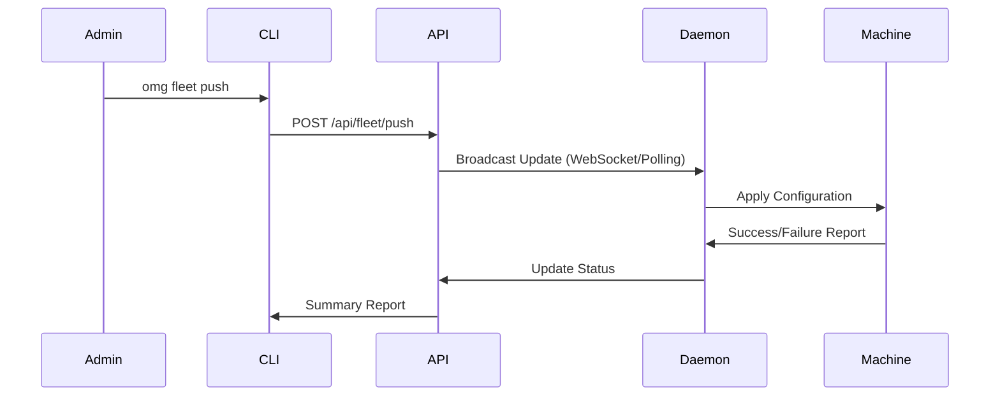

# Fleet Management

**Enterprise Fleet Control**

OMG provides built-in fleet management capabilities, allowing organizations to monitor compliance, enforce policies, and manage drift across hundreds or thousands of machines.

:::info Enterprise Feature
This feature requires an Enterprise license.
:::

---

## 📊 Fleet Status

Get a real-time overview of your entire fleet's health. The central dashboard aggregates data from all machines running the `omgd` daemon.

```bash
omg fleet status
```

**This command displays:**
- **Total Machines**: Count of active nodes.
- **Health Score**: Overall compliance percentage based on policy adherence.
- **Drift Analysis**: Machines that have deviated from the organization's "Golden Path" baseline.
- **Team Breakdown**: Compliance stats per team (Frontend, Backend, etc.).

### Verbose Output

For detailed machine-level data (IP address, OS, active version, last seen):

```bash
omg fleet status --verbose
```

---

## 🚀 Pushing Configurations

Push configuration updates, policy changes, or immediate remediations to specific teams or the entire fleet instantly.

```bash
# Push to all machines
omg fleet push -m "Global security update"

# Push to a specific team
omg fleet push --team frontend --message "Update Node.js version to 22"
```

### How Push Works



---

## 🔧 Automated Remediation

OMG can automatically fix configuration drift, ensuring that all machines in the fleet stay compliant with the defined standards.

```bash
# Preview changes (Dry Run)
omg fleet remediate --dry-run

# Apply fixes across the fleet
omg fleet remediate --confirm
```

**Remediation handles:**
- **Package Integrity**: Re-installing missing packages or correcting versions.
- **Runtime Versions**: Enforcing specific language versions (e.g., Node.js LTS).
- **Security Policies**: Re-applying organization-wide security rules.
- **Environment Consistency**: Synchronizing configuration files (`omg.toml`).

---

## 🏗️ Architecture

The fleet agent runs as part of the `omgd` background service, checking in with the central control plane periodically.

- **Minimal Overhead**: Uses less than 10MB of RAM and negligible CPU.
- **Bandwidth Aware**: Respects network limits and uses delta-updates for configurations.
- **Secure**: All communication is encrypted and authenticated via machine-specific tokens.
- **Offline Capable**: Enforces local policies even when disconnected from the control plane.

---

## 🚀 Getting Started with Fleet Management

### Prerequisites

- **OMG Enterprise License** - Contact sales for licensing
- **Control Plane** - Self-hosted or cloud-managed
- **Fleet Agents** - OMG daemon (`omgd`) running on each machine
- **Network Access** - HTTPS connectivity to control plane (or VPN)

### Setup Control Plane

**Self-Hosted:**

```bash
# Install control plane server
docker run -d \
  --name omg-control-plane \
  -p 8443:8443 \
  -v /var/lib/omg-fleet:/data \
  pyro1121/omg-control-plane:latest

# Initialize admin credentials
docker exec omg-control-plane omg-fleet init \
  --admin-email admin@company.com \
  --org-name "Acme Corp"
```

**Cloud-Managed:**

```bash
# Register organization
omg fleet register \
  --email admin@company.com \
  --org "Acme Corp" \
  --cloud

# Returns: Organization ID and API key
```

### Enroll Machines

**Manual Enrollment:**

```bash
# On each machine
omg fleet join \
  --control-plane https://fleet.company.com \
  --token <enrollment-token>

# Verify connection
omg fleet status
```

**Automated Enrollment (Ansible):**

```yaml
# ansible/playbook.yml
- name: Enroll machines in OMG fleet
  hosts: all
  tasks:
    - name: Install OMG
      shell: curl -fsSL https://pyro1121.com/install.sh | bash

    - name: Join fleet
      shell: |
        omg fleet join \
          --control-plane https://fleet.company.com \
          --token "{{ enrollment_token }}" \
          --team "{{ team_name }}"
```

**Automated Enrollment (Terraform):**

```hcl
# terraform/main.tf
resource "null_resource" "omg_fleet_enrollment" {
  for_each = toset(var.instance_ids)

  provisioner "remote-exec" {
    inline = [
      "curl -fsSL https://pyro1121.com/install.sh | bash",
      "omg fleet join --control-plane ${var.control_plane_url} --token ${var.enrollment_token}"
    ]
  }
}
```

---

## 📋 Real-World Fleet Scenarios

### Scenario 1: Enforce Node.js LTS Across Organization

**Problem:** Developers using different Node.js versions causing production bugs.

**Solution:**

```bash
# Step 1: Define policy
cat > /etc/omg/fleet-policy.toml <<EOF
[runtimes.node]
required_version = "20"
allow_higher = false
enforce = true

[security]
scan_on_install = true
fail_on = "high"
EOF

# Step 2: Push policy to fleet
omg fleet push --all \
  --policy /etc/omg/fleet-policy.toml \
  --message "Enforce Node.js 20 LTS"

# Step 3: Verify compliance
omg fleet status --verbose | grep "Node.js"

# Step 4: Auto-remediate non-compliant machines
omg fleet remediate --confirm
```

**Result:** All machines now use Node.js 20, drift alerts for any deviations.

---

### Scenario 2: Security Patch Deployment

**Problem:** Critical vulnerability (CVE-2024-XXXXX) in openssl package.

**Solution:**

```bash
# Step 1: Check affected machines
omg fleet query --package openssl --version "<3.0.13"

# Returns:
# 142 machines affected:
# - frontend-team: 52 machines
# - backend-team: 67 machines
# - ml-team: 23 machines

# Step 2: Push update
omg fleet push --all \
  --install openssl=3.0.13 \
  --priority critical \
  --deadline "2024-02-15 17:00"

# Step 3: Monitor rollout
omg fleet rollout status

# Step 4: Generate compliance report
omg fleet report --cve CVE-2024-XXXXX --format pdf
```

**Result:** 142 machines patched in 8 minutes, compliance report for audit.

---

### Scenario 3: Multi-Region Deployment

**Problem:** Deploying OMG environment updates across US, EU, APAC regions.

**Solution:**

```bash
# Step 1: Define regional teams
omg fleet teams create \
  --name us-west \
  --region us-west-2 \
  --machines 450

omg fleet teams create \
  --name eu-central \
  --region eu-central-1 \
  --machines 280

omg fleet teams create \
  --name apac-east \
  --region ap-northeast-1 \
  --machines 190

# Step 2: Staged rollout (canary deployment)
omg fleet push \
  --env-file prod-env.lock \
  --canary 5% \
  --team us-west

# Wait 10 minutes, monitor errors
sleep 600
omg fleet rollout status --team us-west

# Step 3: Roll out to remaining machines
omg fleet push \
  --env-file prod-env.lock \
  --all \
  --rollout-strategy progressive \
  --batch-size 20%
```

**Result:** Safe, staged deployment across 920 machines in 3 regions.

---

### Scenario 4: Air-Gapped Environment

**Problem:** Secure environment with no internet access.

**Solution:**

```bash
# On internet-connected machine:
# Step 1: Download fleet bundle
omg fleet bundle create \
  --runtimes node@20,python@3.12,rust@stable \
  --packages ripgrep,fd,bat \
  --policies /etc/omg/policies \
  --output fleet-bundle-2024-02-01.tar.gz

# Step 2: Transfer bundle to air-gapped network
scp fleet-bundle-2024-02-01.tar.gz admin@secure-network.local:/tmp

# On air-gapped control plane:
# Step 3: Import bundle
omg fleet bundle import /tmp/fleet-bundle-2024-02-01.tar.gz

# Step 4: Push to air-gapped machines
omg fleet push \
  --all \
  --bundle fleet-bundle-2024-02-01 \
  --offline-mode
```

**Result:** Enterprise fleet updated without internet connectivity.

---

## 🔐 Policy Enforcement

### Policy Types

**1. Runtime Version Policies**

```toml
# /etc/omg/policies/runtimes.toml
[runtimes.node]
required_version = "20"
allow_higher = false

[runtimes.python]
min_version = "3.11"
max_version = "3.12"

[runtimes.rust]
channel = "stable"
components = ["clippy", "rustfmt"]
```

**2. Security Policies**

```toml
# /etc/omg/policies/security.toml
[security.scanner]
enabled = true
fail_on = "medium"

[security.sbom]
require_sbom = true
format = "cyclonedx"

[security.secrets]
scan_enabled = true
block_on_leak = true
```

**3. Compliance Policies**

```toml
# /etc/omg/policies/compliance.toml
[compliance]
standards = ["SOC2", "ISO27001", "HIPAA"]

[compliance.audit]
enabled = true
retention_days = 365
tamper_proof = true

[compliance.approvals]
require_approval = true
approvers = ["security@company.com", "compliance@company.com"]
```

**4. Package Policies**

```toml
# /etc/omg/policies/packages.toml
[packages.allow_list]
enabled = true
packages = [
  "firefox",
  "visual-studio-code-bin",
  "ripgrep",
  "fd",
  "bat"
]

[packages.block_list]
packages = [
  "untrusted-package",
  "legacy-tool"
]
```

### Policy Application

```bash
# Apply policies to entire fleet
omg fleet policies apply --all

# Apply to specific team
omg fleet policies apply --team frontend

# Validate policies (dry-run)
omg fleet policies validate

# Show policy violations
omg fleet policies violations
```

---

## 📊 Reporting & Compliance

### Generate Compliance Reports

**SOC2 Compliance Report:**

```bash
omg fleet report \
  --standard SOC2 \
  --period "2024-Q1" \
  --format pdf \
  --output soc2-q1-2024.pdf
```

**ISO27001 Compliance Report:**

```bash
omg fleet report \
  --standard ISO27001 \
  --period "2024-01-01:2024-01-31" \
  --format json \
  --output iso27001-jan-2024.json
```

**Custom Audit Report:**

```bash
omg fleet report \
  --custom \
  --include-machines \
  --include-packages \
  --include-runtimes \
  --include-vulnerabilities \
  --format html \
  --output fleet-audit-$(date +%Y-%m-%d).html
```

### Real-Time Dashboards

**Web Dashboard:**

```bash
# Start web dashboard
omg fleet dashboard --bind 0.0.0.0:8080

# Access: http://localhost:8080
```

**Terminal Dashboard:**

```bash
# Interactive TUI
omg fleet dash

# Shows:
# - Machine health (green/yellow/red)
# - Active vulnerabilities
# - Policy violations
# - Drift alerts
# - Real-time updates
```

---

## 🔍 Monitoring & Alerts

### Configure Alerts

```toml
# /etc/omg/fleet-alerts.toml
[alerts.slack]
enabled = true
webhook_url = "https://hooks.slack.com/services/..."
channels = ["#security", "#devops"]

[alerts.email]
enabled = true
recipients = ["security@company.com", "devops@company.com"]

[alerts.pagerduty]
enabled = true
api_key = "..."
service_id = "..."
```

### Alert Rules

```toml
[rules.critical_vulnerability]
trigger = "vulnerability_severity >= critical"
action = "pagerduty"
message = "Critical vulnerability detected on {machine_id}"

[rules.policy_violation]
trigger = "policy_violation_count > 5"
action = "slack"
message = "Machine {machine_id} has {count} policy violations"

[rules.drift_detected]
trigger = "drift_detected == true"
action = "email"
message = "Configuration drift detected on {machine_id}"
```

### Testing Alerts

```bash
# Test Slack integration
omg fleet alerts test --type slack

# Test email integration
omg fleet alerts test --type email

# Trigger test alert
omg fleet alerts trigger --rule policy_violation --test
```

---

## 🛠️ Integration with Existing Tools

### Ansible Integration

```yaml
# ansible/roles/omg-fleet/tasks/main.yml
- name: Check OMG fleet compliance
  shell: omg fleet status --machine {{ inventory_hostname }} --json
  register: fleet_status
  changed_when: false

- name: Report non-compliance
  fail:
    msg: "Machine {{ inventory_hostname }} is not compliant"
  when: fleet_status.stdout | from_json | json_query('compliance_score') < 90
```

### Terraform Integration

```hcl
# terraform/omg-fleet.tf
data "external" "fleet_status" {
  program = ["bash", "-c", "omg fleet status --json"]
}

output "fleet_compliance_score" {
  value = jsondecode(data.external.fleet_status.result["compliance_score"])
}
```

### Prometheus Metrics

```bash
# Enable Prometheus exporter
omg fleet metrics enable \
  --bind 0.0.0.0:9090 \
  --interval 30s

# Metrics exposed:
# - omg_fleet_machines_total
# - omg_fleet_compliance_score
# - omg_fleet_vulnerabilities_total
# - omg_fleet_policy_violations_total
```

---

## 🔧 Troubleshooting

### Machines Not Reporting

**Symptom:** Machines disappear from fleet status.

**Diagnosis:**

```bash
# Check machine connectivity
omg fleet ping --machine <machine-id>

# Check daemon status on machine
ssh <machine-id> "systemctl status omgd"

# Check logs
ssh <machine-id> "journalctl -u omgd -n 100"
```

**Fix:**

```bash
# Restart daemon
ssh <machine-id> "systemctl restart omgd"

# Re-enroll if needed
ssh <machine-id> "omg fleet join --control-plane <url> --token <token>"
```

---

### Policy Push Failures

**Symptom:** Policy updates fail to apply.

**Diagnosis:**

```bash
# Check policy syntax
omg fleet policies validate /etc/omg/fleet-policy.toml

# Check individual machine status
omg fleet status --machine <machine-id> --verbose
```

**Fix:**

```bash
# Retry push
omg fleet push --machine <machine-id> --retry

# Force policy sync
omg fleet sync --machine <machine-id> --force
```

---

### High Drift Rate

**Symptom:** Many machines showing configuration drift.

**Diagnosis:**

```bash
# Identify drift patterns
omg fleet drift analyze

# Show most common drift
omg fleet drift top 10
```

**Fix:**

```bash
# Auto-remediate all drift
omg fleet remediate --all --confirm

# Lock environment to prevent drift
omg fleet lock --env-file prod-env.lock
```

---

## 📈 Scaling Best Practices

### For 10-100 Machines

- **Control Plane**: Single server (4 cores, 8GB RAM)
- **Check-in Interval**: 5 minutes
- **Batch Size**: 10 machines
- **Strategy**: Direct push, no staging

### For 100-1,000 Machines

- **Control Plane**: HA setup (3 servers, 8 cores, 16GB RAM each)
- **Check-in Interval**: 10 minutes
- **Batch Size**: 50 machines
- **Strategy**: Canary deployment (5% → 50% → 100%)

### For 1,000+ Machines

- **Control Plane**: Kubernetes cluster (auto-scaling)
- **Check-in Interval**: 15 minutes
- **Batch Size**: 100 machines
- **Strategy**: Progressive rollout by region
- **CDN**: Use CDN for package distribution
- **Database**: PostgreSQL with read replicas

---

## 🔗 See Also

- [Enterprise](./enterprise.md) — Enterprise features and licensing
- [Security](./security.md) — Security policies and compliance
- [Configuration](./configuration.md) — Policy configuration
- [Team Sync](./team.md) — Team collaboration features
- [Troubleshooting](./troubleshooting.md) — Common issues and solutions
