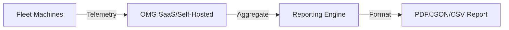
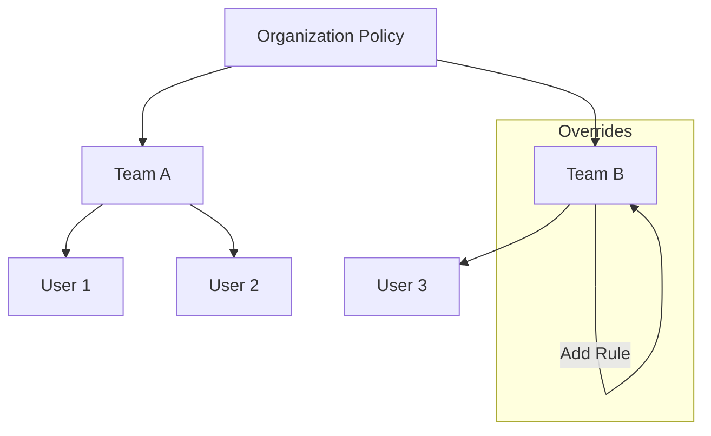

# Enterprise Features

**Compliance, Reporting, and Control**

OMG Enterprise provides the tools large organizations need to manage software supply chain security, compliance, and infrastructure at scale.

:::info Enterprise Feature
These features require an Enterprise license.
:::

---

## 📋 Executive Reports

Generate high-level reports for stakeholders. OMG's reporting engine aggregates telemetry from across your fleet to provide actionable insights.

```bash
# Generate a JSON report
omg enterprise reports compliance json

# Supported types:
# - compliance: Overall system health and policy adherence
# - security: Vulnerability trends and remediation
# - usage: Team adoption and package usage stats
```

### Reporting Flow



---

## 🔒 Audit Export

Export comprehensive audit evidence for compliance frameworks (SOC2, ISO27001, FedRAMP).

```bash
omg enterprise audit-export --format soc2 --output ./evidence
```

**Generates:**
- `access-control-matrix.csv`: User permissions and roles.
- `change-log.json`: Immutable log of system changes.
- `policy-enforcement.json`: Proof of policy active enforcement.
- `vulnerability-remediation.csv`: Timeline of CVE fixes.
- `sbom-inventory.json`: Complete software bill of materials.

---

## ⚖️ License Compliance

Scan your dependencies for license violations to ensure your organization stays compliant with open-source licenses.

```bash
omg enterprise license-scan
```

- **Inventory**: Break down dependencies by license type (MIT, Apache, GPL, etc.).
- **Violations**: Flag forbidden licenses based on your organization's policy.
- **Export**: Generate CSV or SPDX reports.

```bash
omg enterprise license-scan --export csv
```

---

## 📜 Policy Management

Define and enforce rules across the entire organization. Policies are pushed from the central control plane to all connected machines.

### Hierarchical Policies

Policies can be set at the Organization level and inherited by Teams, with specific overrides where necessary.

```bash
# View active policies
omg enterprise policy show

# Set a rule (admin only)
omg enterprise policy set --scope organization --rule "require_pgp=true"
```

### Inheritance Model



---

## 🏢 Self-Hosted Server

Run your own OMG registry and control plane for air-gapped or private environments. Complete data sovereignty for your organization.

### Initialization

```bash
omg enterprise server init \
  --license-key "YOUR-KEY" \
  --storage /mnt/data/omg \
  --domain registry.internal.corp
```

### Mirroring

Sync packages from upstream (official repos, npm, PyPI) to your private mirror.

```bash
omg enterprise server mirror --upstream https://registry.npmjs.org
```

**Benefits:**
- **Control**: Exactly which packages enter your network.
- **Security**: Scan packages before they reach developers.
- **Reliability**: Continue working during internet outages.
- **Performance**: Near-instant downloads over local network.
